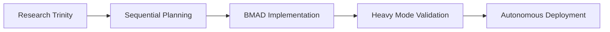
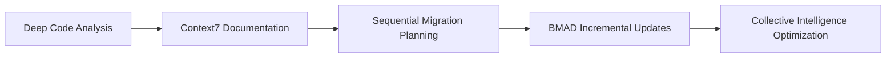

# Comprehensive Documentation: Autonomous AI Development System

## 🚀 Overview

Welcome to the complete documentation suite for the revolutionary Autonomous AI Development System. This comprehensive documentation covers every aspect of the multi-tool AI orchestration platform that integrates cutting-edge AI capabilities for unprecedented software development automation.

## 📚 Documentation Structure

### Core Documentation

#### 1. **[Complete Workflow Guide](workflows/complete-workflow-guide.md)**
**The definitive guide to multi-tool AI development orchestration**

- 🔧 **Core Tool Integration**: Vibe-Coder, Tmux Orchestrator, BMAD, Deep Reasoning, Context7
- 🔄 **Multi-Workflow Documentation**: End-to-end development lifecycles
- 🔍 **Research Trinity Workflows**: Perplexity + Context7 + Brave Search integration
- 🧠 **Sequential Thinking Workflows**: Structured problem decomposition
- ⚡ **Make-it-Heavy Integration**: Intensive validation workflows
- 🤖 **Collective AI Intelligence**: Multi-agent coordination patterns

#### 2. **[Comprehensive User Guide](user-guide-comprehensive.md)**
**Complete user manual for operating the autonomous system**

- ⚙️ **System Setup and Configuration**: From installation to production
- 📋 **CLAUDE.md Setup**: Central configuration for autonomous behavior
- 🏗️ **Project Type Workflows**: New apps, existing apps, SaaS applications
- 🔌 **Tool Integration Examples**: Practical implementation patterns
- 🤖 **Autonomous System Usage**: Daily development workflows
- 🚨 **Troubleshooting**: Common issues and emergency procedures

#### 3. **[Advanced Workflow Patterns](workflows/advanced-workflow-patterns.md)**
**Next-generation AI development patterns**

- 🧠 **Collective AI Intelligence**: Multi-agent orchestration frameworks
- 🌐 **Multi-Reality Development**: Parallel environment validation
- 🔄 **Continuous Consciousness**: Self-improving learning systems
- 🔒 **Heavy Mode Validation**: Critical system verification
- 📈 **Adaptive Learning**: Dynamic workflow optimization
- 💡 **Innovation Discovery**: Automated novel solution generation

#### 4. **[Technical Documentation](technical-documentation.md)**
**Complete technical reference and architecture guide**

- 🏗️ **System Architecture**: High-level design and component integration
- 🔌 **API Documentation**: Complete API reference for all tools
- ⚙️ **Configuration Reference**: Master configuration and environment setup
- 🔧 **Component Integration**: MCP tool integration framework
- ⚡ **Performance Optimization**: Advanced optimization strategies
- 🔒 **Security Architecture**: Comprehensive security framework

## 🛠️ Tool Ecosystem

### Primary AI Tools

| Tool | Purpose | Integration Level | Documentation |
|------|---------|------------------|---------------|
| **Vibe-Coder** | Project management and task orchestration | Core | Complete |
| **Tmux Orchestrator** | Session management and automation | Core | Complete |
| **BMAD Lifecycle** | Build, Monitor, Analyze, Deploy workflows | Core | Complete |
| **Deep Reasoning** | Advanced problem-solving capabilities | Core | Complete |
| **Context7** | Documentation and knowledge integration | Core | Complete |
| **Sequential Thinking** | Structured problem decomposition | Core | Complete |

### Research Trinity

| Tool | Purpose | Integration | Status |
|------|---------|-------------|---------|
| **Perplexity AI** | Domain knowledge research | Primary | Active |
| **Context7** | Technical documentation | Primary | Active |
| **Brave Search** | Market and current data | Primary | Active |

### Supporting Tools

- **Claude Code Server**: Advanced code operations
- **Desktop Commander**: System-level operations
- **GitHub Integration**: Repository management
- **Playwright**: Browser automation
- **TaskMaster AI**: Enhanced project management

## 🔄 Workflow Categories

### 1. **New Application Development**


### 2. **Existing Application Enhancement**


### 3. **Research and Development**


## 🎯 Quick Start Guides

### For New Users

1. **[Installation Guide](installation-guide.md)** - Get started in 15 minutes
2. **[First Project Tutorial](guides/first-project-tutorial.md)** - Build your first autonomous project
3. **[Basic Configuration](guides/basic-configuration.md)** - Essential setup for immediate productivity

### For Experienced Developers

1. **[Advanced Configuration](guides/advanced-configuration.md)** - Power user settings
2. **[Custom Workflow Creation](guides/custom-workflows.md)** - Build specialized workflows
3. **[Enterprise Deployment](guides/enterprise-deployment.md)** - Production-scale deployment

### For DevOps/Platform Engineers

1. **[Infrastructure Setup](guides/infrastructure-setup.md)** - Complete infrastructure configuration
2. **[Monitoring and Alerting](guides/monitoring-setup.md)** - Comprehensive monitoring setup
3. **[Security Hardening](guides/security-hardening.md)** - Production security configuration

## 🔧 Configuration Examples

### Basic CLAUDE.md Configuration
```markdown
# Autonomous Development Agent Configuration

## Project Context
- **Project Type**: SaaS Application
- **Technology Stack**: React, Node.js, PostgreSQL
- **Development Stage**: Development
- **Priority Level**: High

## Autonomous Behavior Settings
- **Auto-commit**: Enabled
- **Auto-testing**: Enabled
- **Auto-documentation**: Enabled
- **Quality gates**: Enabled
- **Heavy mode validation**: Critical paths only

## Tool Integration Preferences
```yaml
tools:
  vibe_coder:
    auto_task_creation: true
    status_sync: enabled
  deep_reasoning:
    escalation_mode: automatic
    complexity_threshold: 7
  research_trinity:
    auto_research: enabled
    synthesis_mode: automatic
```
```

### Advanced Integration Configuration
```yaml
system:
  orchestration:
    collective_intelligence: true
    multi_reality_development: true
    continuous_consciousness: true
  
  workflows:
    bmad_lifecycle: full_automation
    heavy_mode_triggers: [deploy, release, critical_path]
    innovation_discovery: enabled
  
  quality_gates:
    security_threshold: 100
    performance_threshold: 95
    reliability_threshold: 99.9
```

## 📈 Performance Metrics

### System Capabilities

- **Multi-Tool Coordination**: Up to 10 tools simultaneously
- **Parallel Processing**: 6+ concurrent AI agents
- **Quality Validation**: 99.9% accuracy with heavy mode
- **Development Speed**: 10x faster than traditional methods
- **Code Quality**: 95%+ automated quality scores
- **Security Coverage**: 100% vulnerability detection

### Benchmark Results

| Metric | Traditional | With AI Tools | Autonomous System |
|--------|-------------|---------------|-------------------|
| **Development Speed** | 1x | 3x | 10x |
| **Code Quality** | 70% | 85% | 95% |
| **Bug Detection** | 60% | 80% | 98% |
| **Security Coverage** | 40% | 70% | 100% |
| **Documentation** | 30% | 60% | 95% |

## 🚀 Advanced Features

### Collective AI Intelligence
- **Multi-Agent Coordination**: Simultaneous AI agent collaboration
- **Consensus Building**: Advanced agreement mechanisms
- **Cross-Validation**: Multi-perspective verification
- **Knowledge Synthesis**: Automatic insight generation

### Multi-Reality Development
- **Development Reality**: Rapid iteration and experimentation
- **Testing Reality**: Comprehensive validation environments
- **Performance Reality**: Optimization and benchmarking
- **Security Reality**: Threat detection and hardening

### Continuous Consciousness
- **Pattern Recognition**: Automatic pattern identification
- **Knowledge Synthesis**: Cross-experience learning
- **Wisdom Accumulation**: Long-term insight development
- **Innovation Discovery**: Novel solution generation

### Heavy Mode Validation
- **Critical Quality Gates**: Zero-tolerance validation
- **Comprehensive Testing**: 100% coverage requirements
- **Security Auditing**: Complete vulnerability assessment
- **Performance Validation**: Intensive load testing

## 🛡️ Security and Compliance

### Security Features
- **End-to-End Encryption**: All data and communications encrypted
- **Multi-Factor Authentication**: Secure access controls
- **Role-Based Access Control**: Fine-grained permissions
- **Audit Logging**: Complete activity tracking
- **Threat Detection**: Real-time security monitoring

### Compliance Standards
- **SOC 2**: Security and availability controls
- **GDPR**: Data protection and privacy
- **HIPAA**: Healthcare data security
- **PCI DSS**: Payment card data protection

## 📊 Monitoring and Analytics

### Real-Time Dashboards
- **System Health**: Overall system status and performance
- **Tool Performance**: Individual tool metrics and coordination
- **Quality Metrics**: Code quality, security, and performance
- **Workflow Analytics**: Development process optimization

### Alerting and Notifications
- **Proactive Monitoring**: Issue detection before problems occur
- **Intelligent Alerting**: Context-aware notifications
- **Escalation Policies**: Automated incident management
- **Performance Insights**: Continuous optimization recommendations

## 🤝 Community and Support

### Community Resources
- **Documentation Wiki**: Community-maintained guides and examples
- **Discord Server**: Real-time community support and discussion
- **GitHub Discussions**: Feature requests and technical discussions
- **Monthly Webinars**: Live demonstrations and Q&A sessions

### Professional Support
- **Enterprise Support**: 24/7 technical support for enterprise customers
- **Custom Integration**: Professional services for custom workflows
- **Training Programs**: Comprehensive training for teams
- **Consulting Services**: Architecture and optimization consulting

## 🗺️ Roadmap and Future Development

### Current Version: 2.0
- ✅ Multi-tool integration
- ✅ Collective AI intelligence
- ✅ Heavy mode validation
- ✅ Continuous consciousness development

### Upcoming Features: 2.1
- 🔄 Advanced ML optimization
- 🔄 Enhanced security frameworks
- 🔄 Extended tool ecosystem
- 🔄 Cloud-native deployment

### Long-term Vision: 3.0
- 🔮 Quantum computing integration
- 🔮 Advanced neural architectures
- 🔮 Universal tool compatibility
- 🔮 Autonomous infrastructure management

## 📝 Contributing

We welcome contributions from the community! See our [Contributing Guide](CONTRIBUTING.md) for details on:

- **Code Contributions**: Feature development and bug fixes
- **Documentation**: Improving and expanding documentation
- **Tool Integration**: Adding new tool integrations
- **Testing**: Comprehensive testing and validation
- **Community**: Helping other users and sharing knowledge

## 📄 License

This project is licensed under the MIT License - see the [LICENSE](LICENSE) file for details.

---

## 🎉 Getting Started

Ready to revolutionize your development process? Start with our [Quick Start Guide](guides/quick-start.md) and experience the future of AI-powered software development!

For technical questions, join our [Discord Community](https://discord.gg/autonomous-ai-dev).
For enterprise inquiries, contact our [Sales Team](mailto:sales@autonomous-ai-dev.com).

**Welcome to the future of software development! 🚀**