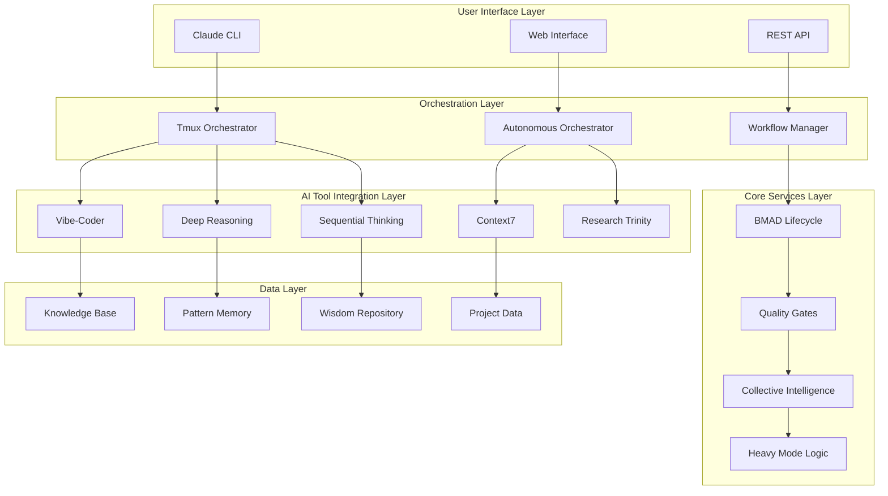

# Technical Documentation: Autonomous AI Development System

## Table of Contents
- [System Architecture Overview](#system-architecture-overview)
- [API Documentation](#api-documentation)
- [Configuration Reference](#configuration-reference)
- [Component Integration](#component-integration)
- [Performance Optimization](#performance-optimization)
- [Security Architecture](#security-architecture)
- [Troubleshooting Guide](#troubleshooting-guide)
- [Deployment Guide](#deployment-guide)

## System Architecture Overview

### High-Level Architecture



### Component Architecture

#### Core Components

1. **Tmux Orchestrator**
   - Session management and automation
   - Real-time monitoring and reporting
   - Cross-tool communication coordination
   - Autonomous workflow execution

2. **BMAD Lifecycle Engine**
   - Build, Monitor, Analyze, Deploy workflows
   - Continuous integration and deployment
   - Quality assurance automation
   - Performance monitoring

3. **Collective Intelligence Engine**
   - Multi-agent coordination
   - Consensus building mechanisms
   - Cross-validation workflows
   - Knowledge synthesis

4. **Heavy Mode Validation**
   - Intensive quality validation
   - Critical system verification
   - Comprehensive testing workflows
   - Security and compliance validation

#### Tool Integration Layer

```python
# Tool Integration Architecture
class ToolIntegrationArchitecture:
    def __init__(self):
        self.mcp_tools = {
            'vibe_kanban': VibeCoder(),
            'deep_code_reasoning': DeepReasoning(),
            'sequential_thinking': SequentialThinking(),
            'context7': Context7(),
            'perplexity_mcp': PerplexityMCP(),
            'brave_search': BraveSearch(),
            'claude_code': ClaudeCodeServer(),
            'desktop_commander': DesktopCommander(),
            'github': GitHubIntegration(),
            'playwright': PlaywrightAutomation()
        }
        
        self.integration_manager = MCPIntegrationManager()
        self.tool_coordinator = ToolCoordinator()
    
    async def initialize_tool_ecosystem(self):
        """Initialize and coordinate all MCP tools"""
        # Initialize MCP connections
        for tool_name, tool_instance in self.mcp_tools.items():
            await tool_instance.initialize()
        
        # Establish inter-tool communication
        await self.integration_manager.establish_tool_mesh()
        
        # Configure tool coordination protocols
        await self.tool_coordinator.configure_coordination()
```

### Data Flow Architecture

```yaml
Data Flow Patterns:
  Input Processing:
    - User commands via CLI/Web/API
    - Real-time monitoring data
    - External API responses
    - Git repository changes
  
  Processing Pipeline:
    - Command interpretation and routing
    - Tool selection and coordination
    - Parallel execution management
    - Result aggregation and synthesis
  
  Output Generation:
    - Formatted responses to user interfaces
    - Automated actions and commits
    - Monitoring and alerting data
    - Knowledge base updates
  
  Feedback Loops:
    - Performance monitoring feedback
    - Quality metrics feedback
    - User interaction feedback
    - Learning and adaptation feedback
```

## API Documentation

### Core API Endpoints

#### Workflow Management API

```typescript
// Workflow Management API Interface
interface WorkflowAPI {
  // Start autonomous workflow
  POST /api/v1/workflows/start
  Request: {
    projectId: string;
    workflowType: 'new-app' | 'existing-app' | 'saas' | 'research';
    configuration: WorkflowConfiguration;
    autonomyLevel: 'manual' | 'assisted' | 'autonomous';
  }
  Response: {
    workflowId: string;
    status: 'started' | 'error';
    sessionInfo: SessionInfo;
    estimatedDuration: number;
  }
  
  // Get workflow status
  GET /api/v1/workflows/{workflowId}/status
  Response: {
    workflowId: string;
    status: 'running' | 'completed' | 'failed' | 'paused';
    progress: number;
    currentPhase: string;
    metrics: WorkflowMetrics;
    logs: LogEntry[];
  }
  
  // Control workflow execution
  POST /api/v1/workflows/{workflowId}/control
  Request: {
    action: 'pause' | 'resume' | 'stop' | 'restart';
    parameters?: ControlParameters;
  }
  Response: {
    success: boolean;
    newStatus: string;
    message: string;
  }
}
```

#### Tool Integration API

```typescript
// Tool Integration API Interface
interface ToolAPI {
  // Execute tool operation
  POST /api/v1/tools/{toolName}/execute
  Request: {
    operation: string;
    parameters: Record<string, any>;
    context: ExecutionContext;
    coordination: CoordinationSettings;
  }
  Response: {
    executionId: string;
    result: ToolExecutionResult;
    metadata: ExecutionMetadata;
    nextRecommendations: Recommendation[];
  }
  
  // Get tool status and capabilities
  GET /api/v1/tools/{toolName}/info
  Response: {
    toolName: string;
    version: string;
    status: 'active' | 'inactive' | 'error';
    capabilities: ToolCapability[];
    currentLoad: number;
    healthMetrics: HealthMetrics;
  }
  
  // Coordinate multi-tool operations
  POST /api/v1/tools/coordinate
  Request: {
    tools: string[];
    operation: CoordinatedOperation;
    sequencing: 'parallel' | 'sequential' | 'hybrid';
    dependencies: ToolDependency[];
  }
  Response: {
    coordinationId: string;
    executionPlan: ExecutionPlan;
    estimatedDuration: number;
    resourceRequirements: ResourceRequirements;
  }
}
```

#### Quality Gates API

```typescript
// Quality Gates API Interface
interface QualityGatesAPI {
  // Execute quality gate validation
  POST /api/v1/quality-gates/validate
  Request: {
    gateType: 'security' | 'performance' | 'reliability' | 'compliance';
    validationLevel: 'basic' | 'standard' | 'heavy';
    artifacts: ValidationArtifact[];
    criteria: QualityCriteria;
  }
  Response: {
    validationId: string;
    gateStatus: 'passed' | 'failed' | 'warning';
    score: number;
    issues: QualityIssue[];
    recommendations: QualityRecommendation[];
  }
  
  // Configure quality gates
  PUT /api/v1/quality-gates/config
  Request: {
    projectId: string;
    gateConfiguration: QualityGateConfiguration;
    thresholds: QualityThresholds;
    automationSettings: AutomationSettings;
  }
  Response: {
    configurationId: string;
    appliedSettings: AppliedSettings;
    validationStatus: ValidationStatus;
  }
}
```

### MCP Tool Integration APIs

#### Vibe-Coder Integration

```python
# Vibe-Coder API Integration
class VibeCoder:
    async def create_project_task(self, project_spec):
        """Create comprehensive project task structure"""
        return await self.mcp_client.call(
            'mcp__vibe_kanban__create_task',
            {
                'project_id': project_spec.project_id,
                'title': project_spec.title,
                'description': project_spec.description
            }
        )
    
    async def update_task_status(self, task_id, status, progress_data):
        """Update task status with detailed progress"""
        return await self.mcp_client.call(
            'mcp__vibe_kanban__update_task',
            {
                'project_id': self.project_id,
                'task_id': task_id,
                'status': status,
                'description': json.dumps(progress_data)
            }
        )
    
    async def get_project_overview(self, project_id):
        """Get comprehensive project overview"""
        tasks = await self.mcp_client.call(
            'mcp__vibe_kanban__list_tasks',
            {'project_id': project_id}
        )
        return self.compile_project_overview(tasks)
```

#### Deep Reasoning Integration

```python
# Deep Reasoning API Integration
class DeepReasoning:
    async def escalate_complex_analysis(self, analysis_request):
        """Escalate complex problems to deep reasoning"""
        return await self.mcp_client.call(
            'mcp__deep_code_reasoning__escalate_analysis',
            {
                'analysis_type': analysis_request.type,
                'claude_context': analysis_request.context,
                'depth_level': analysis_request.depth,
                'time_budget_seconds': analysis_request.timeout
            }
        )
    
    async def start_reasoning_conversation(self, problem_context):
        """Start collaborative reasoning session"""
        return await self.mcp_client.call(
            'mcp__deep_code_reasoning__start_conversation',
            {
                'claude_context': problem_context,
                'analysis_type': 'hypothesis_test',
                'initial_question': problem_context.question
            }
        )
    
    async def run_hypothesis_tournament(self, complex_issue):
        """Run competitive hypothesis tournament"""
        return await self.mcp_client.call(
            'mcp__deep_code_reasoning__run_hypothesis_tournament',
            {
                'claude_context': complex_issue.context,
                'issue': complex_issue.description,
                'tournament_config': {
                    'max_hypotheses': 8,
                    'max_rounds': 4,
                    'parallel_sessions': 6
                }
            }
        )
```

#### Research Trinity Integration

```python
# Research Trinity API Integration
class ResearchTrinity:
    async def execute_comprehensive_research(self, research_query):
        """Execute research using all three tools"""
        # Perplexity for domain knowledge
        perplexity_result = await self.mcp_client.call(
            'mcp__perplexity_mcp__perplexity_search_web',
            {
                'query': research_query.domain_query,
                'recency': research_query.recency
            }
        )
        
        # Context7 for technical documentation
        context7_result = await self.execute_context7_research(research_query)
        
        # Brave Search for market/current data
        brave_result = await self.mcp_client.call(
            'mcp__brave_search__brave_web_search',
            {
                'query': research_query.market_query,
                'count': research_query.result_count
            }
        )
        
        # Synthesize results
        return await self.synthesize_research_results(
            perplexity_result, context7_result, brave_result
        )
    
    async def execute_context7_research(self, research_query):
        """Execute Context7 documentation research"""
        # Resolve library ID
        library_id = await self.mcp_client.call(
            'mcp__context7__resolve_library_id',
            {'libraryName': research_query.library_name}
        )
        
        # Get documentation
        return await self.mcp_client.call(
            'mcp__context7__get_library_docs',
            {
                'context7CompatibleLibraryID': library_id,
                'topic': research_query.technical_focus,
                'tokens': research_query.doc_tokens
            }
        )
```

## Configuration Reference

### Master Configuration File

```yaml
# /mnt/c/bmad-workspace/config/master-config.yaml
system:
  name: "Autonomous AI Development System"
  version: "2.0.0"
  environment: "production"
  debug_mode: false
  logging_level: "INFO"
  
orchestration:
  tmux:
    enabled: true
    session_prefix: "bmad"
    auto_restart: true
    monitoring_interval: 300
    max_sessions: 10
    session_timeout: 7200
  
  autonomous:
    enabled: true
    autonomy_level: "supervised"  # manual, supervised, autonomous
    decision_threshold: 0.8
    human_escalation: true
    learning_enabled: true

tools:
  vibe_coder:
    enabled: true
    endpoint: "mcp__vibe_kanban"
    auto_task_creation: true
    status_sync_interval: 60
    project_templates: ["saas", "web", "mobile", "api"]
    
  deep_reasoning:
    enabled: true
    endpoint: "mcp__deep_code_reasoning"
    default_depth: 3
    escalation_threshold: 0.7
    conversation_timeout: 1800
    hypothesis_tournament: true
    
  sequential_thinking:
    enabled: true
    endpoint: "mcp__sequential_thinking"
    default_thoughts: 10
    revision_enabled: true
    tool_recommendations: true
    adaptive_planning: true
    
  context7:
    enabled: true
    endpoint: "mcp__context7"
    auto_resolve: true
    cache_duration: 3600
    max_tokens: 10000
    preferred_libraries: ["react", "node", "python"]
    
  research_trinity:
    perplexity:
      enabled: true
      endpoint: "mcp__perplexity_mcp"
      default_recency: "month"
      max_queries_per_hour: 100
      
    brave_search:
      enabled: true
      endpoint: "mcp__brave_search"
      default_count: 10
      search_types: ["web", "local"]
      
    context7_integration: true

workflows:
  bmad_lifecycle:
    enabled: true
    phases: ["build", "monitor", "analyze", "deploy"]
    auto_progression: true
    quality_gates: true
    rollback_enabled: true
    
  heavy_mode:
    enabled: true
    triggers: ["deploy", "release", "critical_path"]
    validation_depth: "maximum"
    quality_threshold: 95
    security_threshold: 100
    
  collective_intelligence:
    enabled: true
    agent_coordination: "automatic"
    consensus_threshold: 0.8
    parallel_agents: 6
    cross_validation: true

quality_gates:
  security:
    enabled: true
    vulnerability_threshold: 0
    compliance_required: true
    penetration_testing: true
    
  performance:
    enabled: true
    response_time_threshold: 200
    throughput_threshold: 1000
    resource_usage_threshold: 80
    
  reliability:
    enabled: true
    uptime_threshold: 99.9
    error_rate_threshold: 0.1
    recovery_time_threshold: 300
    
  maintainability:
    enabled: true
    code_coverage_threshold: 80
    complexity_threshold: 10
    documentation_threshold: 90

monitoring:
  real_time:
    enabled: true
    metrics_interval: 30
    alert_threshold: 85
    dashboard_enabled: true
    
  logging:
    level: "INFO"
    retention_days: 30
    structured_logging: true
    log_rotation: true
    
  alerting:
    enabled: true
    channels: ["email", "slack", "webhook"]
    escalation_policy: true
    alert_suppression: true

security:
  authentication:
    required: true
    methods: ["api_key", "oauth2"]
    session_timeout: 3600
    
  authorization:
    rbac_enabled: true
    permissions_model: "fine_grained"
    audit_logging: true
    
  encryption:
    data_at_rest: true
    data_in_transit: true
    key_rotation: true
    
  compliance:
    frameworks: ["SOC2", "GDPR", "HIPAA"]
    audit_trail: true
    data_governance: true

performance:
  resource_limits:
    cpu_limit: "80%"
    memory_limit: "16GB"
    disk_limit: "100GB"
    network_limit: "1Gbps"
    
  optimization:
    caching_enabled: true
    compression_enabled: true
    connection_pooling: true
    async_processing: true
    
  scaling:
    auto_scaling: true
    min_instances: 2
    max_instances: 10
    scaling_threshold: 70
```

### Environment-Specific Configurations

#### Development Environment

```yaml
# /mnt/c/bmad-workspace/config/environments/development.yaml
extends: "../master-config.yaml"

system:
  environment: "development"
  debug_mode: true
  logging_level: "DEBUG"

orchestration:
  autonomous:
    autonomy_level: "supervised"
    decision_threshold: 0.6

workflows:
  heavy_mode:
    triggers: ["manual"]
    validation_depth: "standard"

quality_gates:
  security:
    vulnerability_threshold: 5
  performance:
    response_time_threshold: 500
    throughput_threshold: 100

monitoring:
  real_time:
    metrics_interval: 10
    dashboard_enabled: true
```

#### Production Environment

```yaml
# /mnt/c/bmad-workspace/config/environments/production.yaml
extends: "../master-config.yaml"

system:
  environment: "production"
  debug_mode: false
  logging_level: "WARN"

orchestration:
  autonomous:
    autonomy_level: "supervised"
    decision_threshold: 0.9
    human_escalation: true

workflows:
  heavy_mode:
    triggers: ["deploy", "release", "critical_path", "security_alert"]
    validation_depth: "maximum"

quality_gates:
  security:
    vulnerability_threshold: 0
  performance:
    response_time_threshold: 100
    throughput_threshold: 2000

monitoring:
  real_time:
    metrics_interval: 15
    alert_threshold: 75
```

### Tool-Specific Configuration

#### Tmux Orchestrator Configuration

```yaml
# /mnt/c/bmad-workspace/Tmux-Orchestrator/config.yaml
tmux:
  session_management:
    prefix: "bmad"
    auto_attach: true
    persistent_sessions: true
    session_timeout: 7200
    
  window_management:
    default_windows: ["main", "monitoring", "logs", "tests"]
    auto_layout: "tiled"
    window_switching: "automatic"
    
  automation:
    script_execution: true
    background_monitoring: true
    auto_restart: true
    error_recovery: true
    
  integration:
    claude_integration: true
    message_routing: "automatic"
    status_reporting: "real_time"
    log_aggregation: true

claude_integration:
  message_format: "structured"
  status_updates: "every_5_minutes"
  progress_reporting: "milestone_based"
  error_escalation: "immediate"
  
monitoring:
  system_metrics: true
  process_monitoring: true
  resource_tracking: true
  performance_metrics: true
  
notifications:
  channels: ["tmux_status", "file_output", "webhook"]
  frequency: "on_change"
  verbosity: "detailed"
```

## Component Integration

### MCP Tool Integration Framework

```python
# MCP Integration Framework
class MCPIntegrationFramework:
    def __init__(self):
        self.tool_registry = MCPToolRegistry()
        self.coordination_engine = ToolCoordinationEngine()
        self.communication_bus = InterToolCommunicationBus()
        self.state_manager = SharedStateManager()
    
    async def initialize_integration_framework(self):
        """Initialize the complete MCP tool integration framework"""
        
        # Register all MCP tools
        await self.tool_registry.register_tools([
            'vibe_kanban', 'deep_code_reasoning', 'sequential_thinking',
            'context7', 'perplexity_mcp', 'brave_search', 'claude_code',
            'desktop_commander', 'github', 'playwright', 'taskmaster_ai'
        ])
        
        # Establish tool coordination protocols
        await self.coordination_engine.establish_coordination_protocols()
        
        # Initialize communication bus
        await self.communication_bus.initialize_message_routing()
        
        # Setup shared state management
        await self.state_manager.initialize_shared_state()
    
    async def coordinate_multi_tool_workflow(self, workflow_spec):
        """Coordinate workflows spanning multiple MCP tools"""
        
        # Analyze workflow requirements
        tool_requirements = await self.analyze_workflow_requirements(workflow_spec)
        
        # Plan tool execution sequence
        execution_plan = await self.coordination_engine.plan_execution(
            tool_requirements
        )
        
        # Execute coordinated workflow
        execution_results = await self.execute_coordinated_workflow(execution_plan)
        
        # Aggregate and synthesize results
        synthesized_results = await self.synthesize_workflow_results(
            execution_results
        )
        
        return synthesized_results

class ToolCoordinationEngine:
    """Coordinates execution of multiple MCP tools"""
    
    async def plan_execution(self, tool_requirements):
        """Plan the execution sequence for multiple tools"""
        
        # Dependency analysis
        dependencies = await self.analyze_tool_dependencies(tool_requirements)
        
        # Resource optimization
        resource_plan = await self.optimize_resource_allocation(dependencies)
        
        # Execution sequencing
        execution_sequence = await self.determine_execution_sequence(
            dependencies, resource_plan
        )
        
        return {
            'dependencies': dependencies,
            'resource_plan': resource_plan,
            'execution_sequence': execution_sequence,
            'estimated_duration': self.estimate_execution_duration(execution_sequence)
        }
    
    async def execute_coordinated_workflow(self, execution_plan):
        """Execute a coordinated workflow across multiple tools"""
        
        results = {}
        shared_context = SharedWorkflowContext()
        
        for phase in execution_plan.execution_sequence:
            phase_results = await self.execute_workflow_phase(
                phase, shared_context, results
            )
            results[phase.name] = phase_results
            
            # Update shared context with phase results
            await shared_context.update_context(phase_results)
        
        return results
```

### Inter-Tool Communication Protocols

```python
class InterToolCommunicationBus:
    """Manages communication between different MCP tools"""
    
    def __init__(self):
        self.message_router = MessageRouter()
        self.event_bus = EventBus()
        self.data_bridge = DataBridge()
    
    async def route_message(self, source_tool, target_tool, message):
        """Route messages between tools with appropriate transformations"""
        
        # Message validation and transformation
        transformed_message = await self.message_router.transform_message(
            message, source_tool, target_tool
        )
        
        # Route to target tool
        response = await self.message_router.route_to_tool(
            target_tool, transformed_message
        )
        
        # Transform response back to source format
        final_response = await self.message_router.transform_response(
            response, target_tool, source_tool
        )
        
        return final_response
    
    async def broadcast_event(self, event_type, event_data):
        """Broadcast events to all interested tools"""
        
        # Determine interested tools
        interested_tools = await self.event_bus.get_interested_tools(event_type)
        
        # Broadcast to all interested tools
        broadcast_results = {}
        for tool_name in interested_tools:
            result = await self.event_bus.send_event(
                tool_name, event_type, event_data
            )
            broadcast_results[tool_name] = result
        
        return broadcast_results
```

## Performance Optimization

### System Performance Monitoring

```python
class PerformanceMonitor:
    """Comprehensive performance monitoring and optimization"""
    
    def __init__(self):
        self.metrics_collector = MetricsCollector()
        self.performance_analyzer = PerformanceAnalyzer()
        self.optimization_engine = OptimizationEngine()
    
    async def monitor_system_performance(self):
        """Continuously monitor system performance"""
        
        while True:
            # Collect performance metrics
            metrics = await self.metrics_collector.collect_metrics()
            
            # Analyze performance trends
            analysis = await self.performance_analyzer.analyze_trends(metrics)
            
            # Identify optimization opportunities
            optimizations = await self.optimization_engine.identify_optimizations(
                analysis
            )
            
            # Apply automatic optimizations
            if optimizations.automatic_optimizations:
                await self.apply_automatic_optimizations(
                    optimizations.automatic_optimizations
                )
            
            # Alert on performance issues
            if analysis.issues:
                await self.alert_performance_issues(analysis.issues)
            
            await asyncio.sleep(30)  # Monitor every 30 seconds

class OptimizationEngine:
    """Identifies and applies performance optimizations"""
    
    async def identify_optimizations(self, performance_analysis):
        """Identify potential performance optimizations"""
        
        optimizations = {
            'resource_optimizations': [],
            'workflow_optimizations': [],
            'tool_coordination_optimizations': [],
            'caching_optimizations': [],
            'automatic_optimizations': []
        }
        
        # Resource optimization analysis
        if performance_analysis.resource_usage.cpu > 80:
            optimizations['resource_optimizations'].append({
                'type': 'cpu_optimization',
                'action': 'reduce_parallel_operations',
                'impact': 'high'
            })
        
        # Workflow optimization analysis
        if performance_analysis.workflow_efficiency < 70:
            optimizations['workflow_optimizations'].append({
                'type': 'workflow_streamlining',
                'action': 'eliminate_redundant_steps',
                'impact': 'medium'
            })
        
        # Tool coordination optimization
        if performance_analysis.tool_coordination.latency > 500:
            optimizations['tool_coordination_optimizations'].append({
                'type': 'coordination_optimization',
                'action': 'implement_connection_pooling',
                'impact': 'high'
            })
        
        return optimizations
```

### Caching and Data Optimization

```python
class CachingOptimization:
    """Advanced caching strategies for performance optimization"""
    
    def __init__(self):
        self.cache_layers = {
            'memory_cache': MemoryCache(),
            'disk_cache': DiskCache(),
            'distributed_cache': DistributedCache(),
            'intelligent_cache': IntelligentCache()
        }
        
        self.cache_coordinator = CacheCoordinator()
    
    async def optimize_caching_strategy(self, usage_patterns):
        """Optimize caching strategy based on usage patterns"""
        
        # Analyze access patterns
        access_analysis = await self.analyze_access_patterns(usage_patterns)
        
        # Determine optimal cache strategy
        cache_strategy = await self.determine_cache_strategy(access_analysis)
        
        # Implement cache optimizations
        await self.implement_cache_optimizations(cache_strategy)
        
        return cache_strategy
    
    async def implement_intelligent_caching(self, data_type, access_frequency):
        """Implement intelligent caching based on data characteristics"""
        
        if access_frequency == 'high' and data_type == 'tool_responses':
            # Use memory cache for high-frequency tool responses
            await self.cache_layers['memory_cache'].configure_for_tool_responses()
        
        elif access_frequency == 'medium' and data_type == 'research_results':
            # Use disk cache for research results
            await self.cache_layers['disk_cache'].configure_for_research_data()
        
        elif access_frequency == 'low' and data_type == 'historical_data':
            # Use distributed cache for historical data
            await self.cache_layers['distributed_cache'].configure_for_historical_data()
```

## Security Architecture

### Security Framework

```python
class SecurityFramework:
    """Comprehensive security framework for the autonomous system"""
    
    def __init__(self):
        self.authentication_manager = AuthenticationManager()
        self.authorization_manager = AuthorizationManager()
        self.encryption_manager = EncryptionManager()
        self.audit_manager = AuditManager()
        self.threat_detector = ThreatDetector()
    
    async def initialize_security_framework(self):
        """Initialize comprehensive security framework"""
        
        # Setup authentication
        await self.authentication_manager.setup_multi_factor_auth()
        
        # Configure authorization
        await self.authorization_manager.setup_rbac()
        
        # Initialize encryption
        await self.encryption_manager.setup_end_to_end_encryption()
        
        # Start audit logging
        await self.audit_manager.start_comprehensive_auditing()
        
        # Enable threat detection
        await self.threat_detector.start_real_time_monitoring()
    
    async def validate_security_compliance(self, operation_context):
        """Validate security compliance for operations"""
        
        # Authentication validation
        auth_result = await self.authentication_manager.validate_operation(
            operation_context
        )
        
        # Authorization validation
        authz_result = await self.authorization_manager.validate_permissions(
            operation_context, auth_result.user
        )
        
        # Threat detection
        threat_result = await self.threat_detector.scan_for_threats(
            operation_context
        )
        
        # Audit logging
        await self.audit_manager.log_security_validation(
            operation_context, auth_result, authz_result, threat_result
        )
        
        return {
            'authentication': auth_result,
            'authorization': authz_result,
            'threat_detection': threat_result,
            'compliance_status': all([
                auth_result.valid,
                authz_result.authorized,
                not threat_result.threats_detected
            ])
        }

class ThreatDetector:
    """Real-time threat detection and mitigation"""
    
    async def scan_for_threats(self, operation_context):
        """Scan for security threats in real-time"""
        
        threats = []
        
        # Code injection detection
        if await self.detect_code_injection(operation_context):
            threats.append({
                'type': 'code_injection',
                'severity': 'high',
                'mitigation': 'block_operation'
            })
        
        # Unauthorized access detection
        if await self.detect_unauthorized_access(operation_context):
            threats.append({
                'type': 'unauthorized_access',
                'severity': 'critical',
                'mitigation': 'immediate_block'
            })
        
        # Data exfiltration detection
        if await self.detect_data_exfiltration(operation_context):
            threats.append({
                'type': 'data_exfiltration',
                'severity': 'critical',
                'mitigation': 'block_and_alert'
            })
        
        return {
            'threats_detected': len(threats) > 0,
            'threats': threats,
            'risk_level': self.calculate_risk_level(threats)
        }
```

## Troubleshooting Guide

### Common Issues and Resolutions

#### 1. Tool Connection Issues

```bash
# Diagnostic Script: diagnose-tool-connections.sh
#!/bin/bash

echo "=== Tool Connection Diagnostics ==="

# Check MCP server status
echo "Checking MCP server status..."
for tool in vibe_kanban deep_code_reasoning sequential_thinking context7 perplexity_mcp brave_search; do
    echo -n "  $tool: "
    if mcp_tool_test $tool; then
        echo "✓ Connected"
    else
        echo "✗ Failed"
        echo "    Attempting to restart $tool..."
        restart_mcp_tool $tool
    fi
done

# Check API keys
echo "Checking API key configuration..."
check_api_key "ANTHROPIC_API_KEY" "Anthropic Claude"
check_api_key "PERPLEXITY_API_KEY" "Perplexity AI"
check_api_key "BRAVE_API_KEY" "Brave Search"
check_api_key "VIBE_KANBAN_TOKEN" "Vibe Kanban"

# Check network connectivity
echo "Checking network connectivity..."
test_network_connectivity

# Generate diagnostic report
generate_diagnostic_report

echo "=== Diagnostics Complete ==="
```

#### 2. Performance Issues

```python
# Performance Issue Resolution
class PerformanceIssueResolver:
    async def diagnose_performance_issues(self):
        """Diagnose and resolve performance issues"""
        
        # Memory usage analysis
        memory_analysis = await self.analyze_memory_usage()
        if memory_analysis.usage > 90:
            await self.optimize_memory_usage()
        
        # CPU usage analysis
        cpu_analysis = await self.analyze_cpu_usage()
        if cpu_analysis.usage > 85:
            await self.optimize_cpu_usage()
        
        # Network latency analysis
        network_analysis = await self.analyze_network_latency()
        if network_analysis.latency > 500:
            await self.optimize_network_performance()
        
        # Tool coordination efficiency
        coordination_analysis = await self.analyze_tool_coordination()
        if coordination_analysis.efficiency < 70:
            await self.optimize_tool_coordination()
    
    async def optimize_memory_usage(self):
        """Optimize memory usage"""
        # Clear unnecessary caches
        await self.cache_manager.clear_expired_caches()
        
        # Optimize object lifecycle
        await self.memory_manager.optimize_object_lifecycle()
        
        # Reduce parallel operations
        await self.workflow_manager.reduce_parallelism()
    
    async def optimize_cpu_usage(self):
        """Optimize CPU usage"""
        # Reduce concurrent tool operations
        await self.tool_coordinator.limit_concurrent_operations(max_concurrent=3)
        
        # Implement operation queuing
        await self.operation_queue.enable_intelligent_queuing()
        
        # Optimize algorithm efficiency
        await self.algorithm_optimizer.optimize_critical_paths()
```

#### 3. Quality Gate Failures

```python
# Quality Gate Issue Resolution
class QualityGateResolver:
    async def resolve_quality_gate_failures(self, failure_report):
        """Resolve quality gate failures systematically"""
        
        for gate_name, failure_details in failure_report.failures.items():
            if gate_name == 'security':
                await self.resolve_security_issues(failure_details)
            elif gate_name == 'performance':
                await self.resolve_performance_issues(failure_details)
            elif gate_name == 'reliability':
                await self.resolve_reliability_issues(failure_details)
            elif gate_name == 'maintainability':
                await self.resolve_maintainability_issues(failure_details)
    
    async def resolve_security_issues(self, security_failures):
        """Resolve security-related quality gate failures"""
        for issue in security_failures.issues:
            if issue.type == 'vulnerability':
                await self.patch_vulnerability(issue)
            elif issue.type == 'compliance':
                await self.fix_compliance_issue(issue)
            elif issue.type == 'encryption':
                await self.fix_encryption_issue(issue)
    
    async def resolve_performance_issues(self, performance_failures):
        """Resolve performance-related quality gate failures"""
        for issue in performance_failures.issues:
            if issue.type == 'response_time':
                await self.optimize_response_time(issue)
            elif issue.type == 'throughput':
                await self.optimize_throughput(issue)
            elif issue.type == 'resource_usage':
                await self.optimize_resource_usage(issue)
```

#### 4. Workflow Execution Issues

```bash
# Workflow Issue Resolution Script
#!/bin/bash

# workflow-issue-resolver.sh
echo "=== Workflow Issue Resolution ==="

# Check workflow status
echo "Checking workflow status..."
WORKFLOW_ID=$1
if [ -z "$WORKFLOW_ID" ]; then
    echo "Error: Workflow ID not provided"
    exit 1
fi

# Get workflow details
WORKFLOW_STATUS=$(get_workflow_status $WORKFLOW_ID)
echo "Workflow Status: $WORKFLOW_STATUS"

case $WORKFLOW_STATUS in
    "stuck")
        echo "Resolving stuck workflow..."
        unstick_workflow $WORKFLOW_ID
        ;;
    "failed")
        echo "Resolving failed workflow..."
        analyze_workflow_failure $WORKFLOW_ID
        restart_workflow_from_checkpoint $WORKFLOW_ID
        ;;
    "timeout")
        echo "Resolving timeout issues..."
        extend_workflow_timeout $WORKFLOW_ID
        optimize_workflow_performance $WORKFLOW_ID
        ;;
    *)
        echo "Unknown workflow status: $WORKFLOW_STATUS"
        ;;
esac

echo "=== Resolution Complete ==="
```

### Emergency Recovery Procedures

```bash
# Emergency Recovery Script
#!/bin/bash

# emergency-recovery.sh
echo "=== EMERGENCY RECOVERY INITIATED ==="

# Stop all autonomous processes
echo "Stopping all autonomous processes..."
stop_all_autonomous_processes

# Save current state
echo "Saving current system state..."
backup_current_state

# Assess system damage
echo "Assessing system damage..."
damage_assessment=$(assess_system_damage)
echo "Damage Assessment: $damage_assessment"

# Determine recovery strategy
if [ "$damage_assessment" == "critical" ]; then
    echo "Critical damage detected. Initiating full system restore..."
    restore_from_backup
elif [ "$damage_assessment" == "moderate" ]; then
    echo "Moderate damage detected. Initiating selective recovery..."
    selective_recovery
else
    echo "Minor damage detected. Initiating quick recovery..."
    quick_recovery
fi

# Validate recovery
echo "Validating recovery..."
validate_system_recovery

# Generate incident report
echo "Generating incident report..."
generate_incident_report

echo "=== EMERGENCY RECOVERY COMPLETE ==="
```

## Deployment Guide

### Production Deployment

```yaml
# production-deployment.yaml
apiVersion: v1
kind: Deployment
metadata:
  name: autonomous-ai-system
  namespace: production
spec:
  replicas: 3
  selector:
    matchLabels:
      app: autonomous-ai-system
  template:
    metadata:
      labels:
        app: autonomous-ai-system
    spec:
      containers:
      - name: orchestrator
        image: autonomous-ai/orchestrator:latest
        resources:
          requests:
            memory: "4Gi"
            cpu: "2"
          limits:
            memory: "8Gi"
            cpu: "4"
        env:
        - name: ENVIRONMENT
          value: "production"
        - name: LOG_LEVEL
          value: "INFO"
        ports:
        - containerPort: 8080
        livenessProbe:
          httpGet:
            path: /health
            port: 8080
          initialDelaySeconds: 30
          periodSeconds: 10
        readinessProbe:
          httpGet:
            path: /ready
            port: 8080
          initialDelaySeconds: 5
          periodSeconds: 5
```

### Monitoring and Alerting Setup

```yaml
# monitoring-config.yaml
monitoring:
  prometheus:
    enabled: true
    scrape_interval: 15s
    retention: 30d
    
  grafana:
    enabled: true
    dashboards:
      - system_overview
      - tool_performance
      - quality_metrics
      - security_metrics
      
  alertmanager:
    enabled: true
    rules:
      - name: system_health
        alerts:
          - alert: HighCPUUsage
            expr: cpu_usage > 85
            for: 5m
            labels:
              severity: warning
            annotations:
              summary: High CPU usage detected
              
          - alert: HighMemoryUsage
            expr: memory_usage > 90
            for: 5m
            labels:
              severity: critical
            annotations:
              summary: High memory usage detected
              
          - alert: ToolConnectionFailure
            expr: tool_connection_success < 1
            for: 1m
            labels:
              severity: critical
            annotations:
              summary: Tool connection failure detected
```

This comprehensive technical documentation provides the complete reference for understanding, configuring, and troubleshooting the autonomous AI development system. It covers all aspects from high-level architecture to specific troubleshooting procedures, ensuring teams can effectively deploy and maintain the system in production environments.